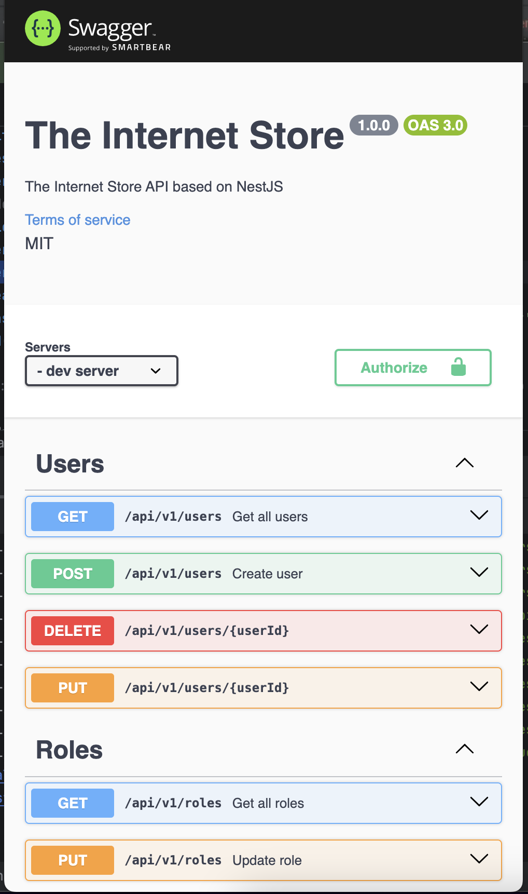
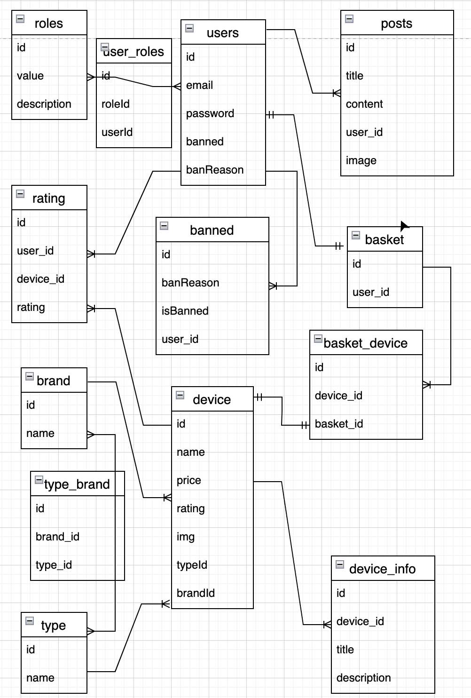

<div align="center">
  <h1>Backend API Nest.js</h1>
  <p>
    
  </p>

  <br/>

  <h2>Model</h2>
  <p>
    
  </p>

</div>
  <br/>
  <br/>

  <details>
  <summary>Install and Use Here</summary>

### PostgreSQL should be installed, and launched

### DB should be created (see .env)

## Installation

```bash
$ npm install
```

## launch

```bash
#  watch mode
$ npm start

# development
$ npm run start:dev

# production mode
$ npm run start:prod
```

## Test

```bash
# unit tests
$ npm run test

# e2e tests
$ npm run test:e2e

# test coverage
$ npm run test:cov
```

</details>
