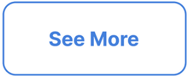
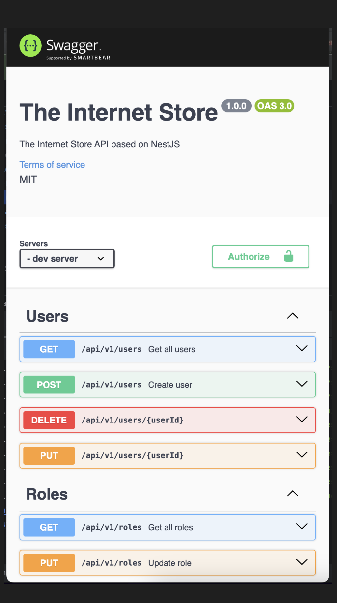
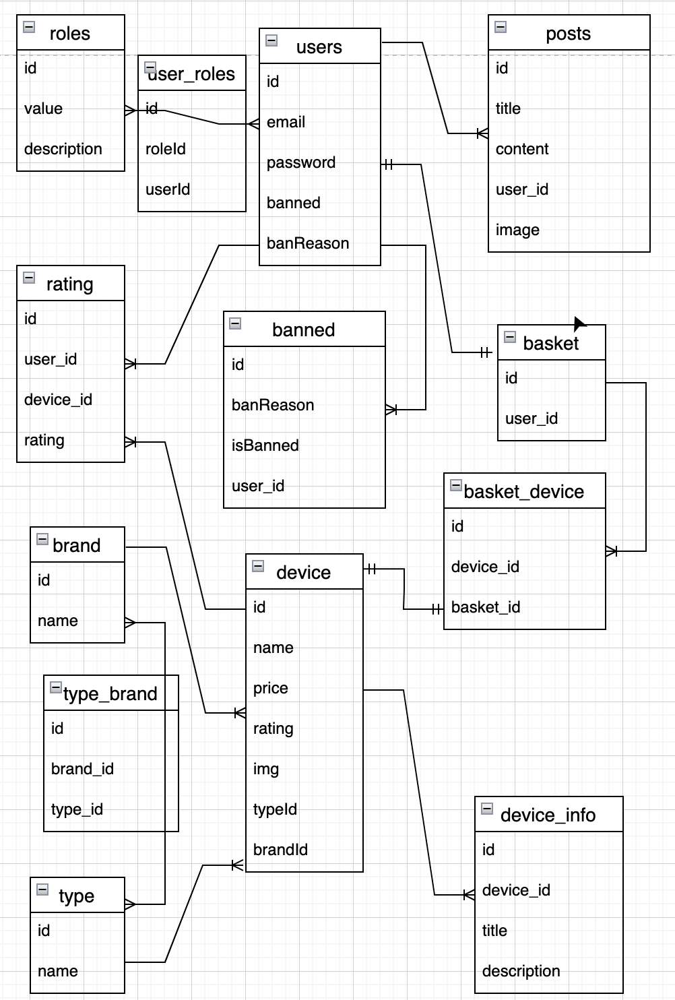

<h1 align="center">Internet Store Full Stack Project</h1>

   

<h2 align="center">Frontend JS TS App</h2>

  in progress...
   
   
  

   

<h2 align="center">Backend Node.js Nest.js App</h2>

  
  
   
   
  

   

<h2 align="center">Android App</h2>

  
    
  

   

<h2 align="center">IOS App</h2>

  
    
  

