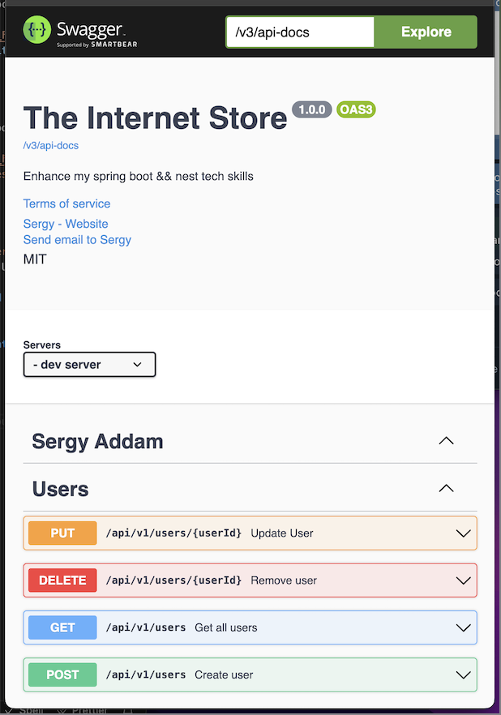

    <h1>Backend API: Java Spring Boot</h1>
        

            Tech: Spring Boot, Hibernate, RDBMS: Postgresql, Auth: Jsonwebtoken, spring-boot-security, Documentation: Swagger
        
    
        

        <h2>Documentation</h2>
        
    

    

        <h2>Model</h2>
        
    
 

