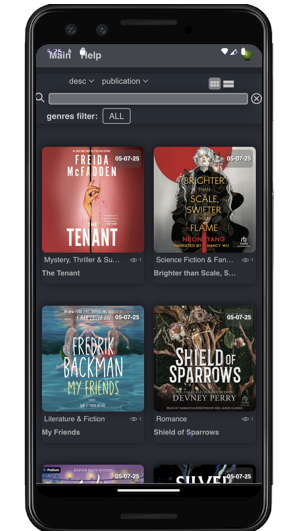
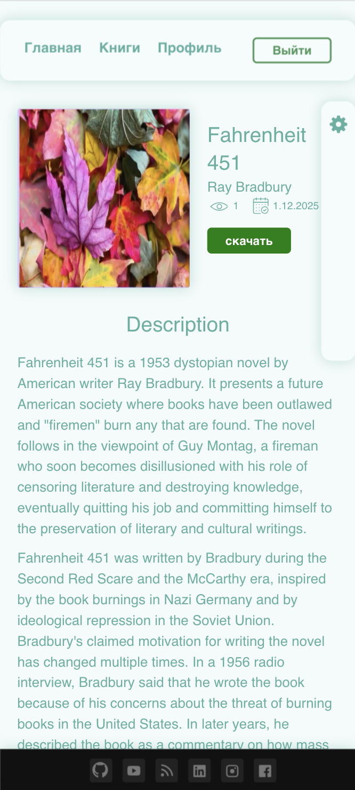
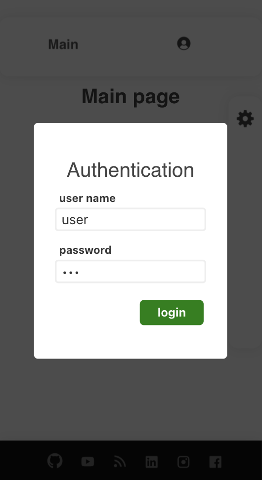
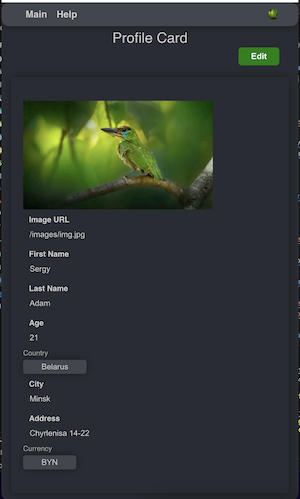
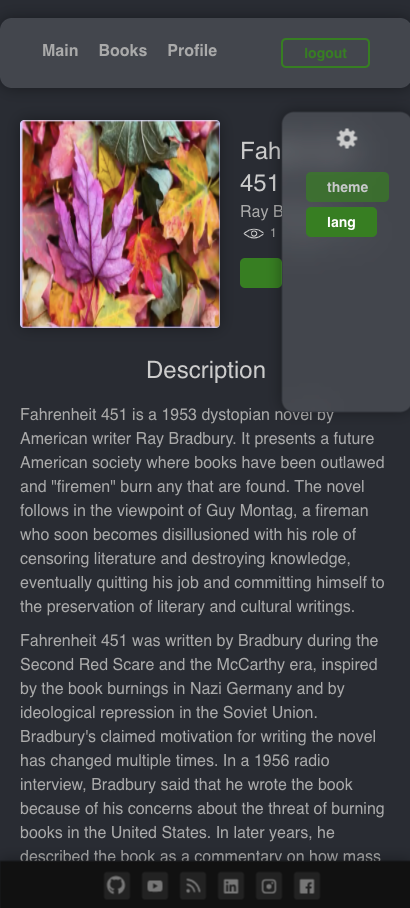
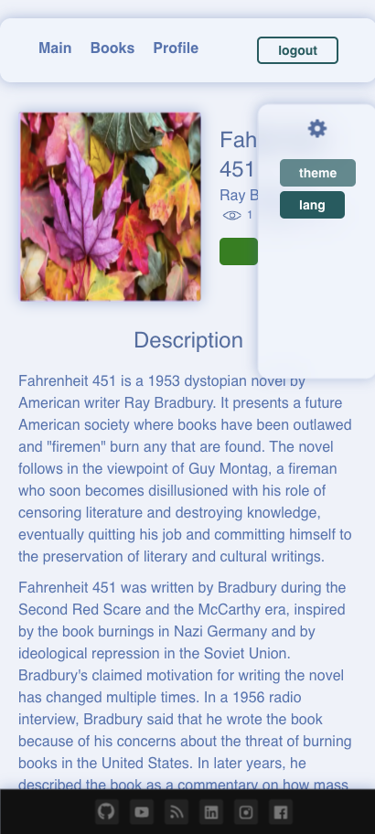
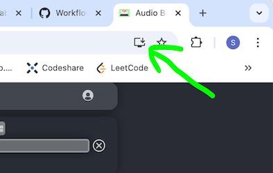
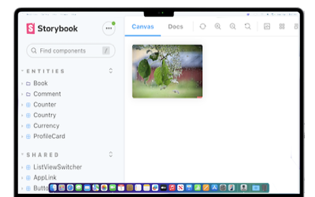

# ИНТЕРНЕТ МАГАЗИН

<br>

# КРАТКО О ПРИЛОЖЕНИИ:

- возможность покупки через yookassa картой (тестируется)

## Страница доступного списка товаров

- возможность сортировки по типу, бренду
- возможность поиска товара

<!--  -->

## О товаре подробнее

<!--  -->

- универсальное описание, состоящее из блоков
- возможность отправки комментария (только для авторизированных пользователей)
- список комментариев
- рекомендованные товары

<br>

## OAUTH2 JWT и Basic аутентификация



- роли пользователя (admin, user, manager)
- возможность использования как Basic так и JWT аутентификацию

<br>

## Страница профиля пользователя



(только для авторизированных пользователей)

- возможность изменять и сохранять поля профиля

<br>

## Различные темы

<!--  -->

<br>

## Интернационализация i18n (RU, EN)

<br>

## Возможность установить Progressive Web App (WPA)



<br><br>

# Технологический стек

## FRONT:

Typescript, React, Thunk (async), RTK query, Webpack, FSD, Redux Toolkit;

## Tests

jest, integration, ui, screenshot tests, ts lint, style lint;

## Storybook:



## CI/CD

## BACK:

Dev: Nodejs json-server (смотри папку mock-server)
<br>
Prod: Java Spring Boot + (H2 | postgresql | mysql...) (смотри sb-lab-api repo)

<br>

# Установка приложения

### разрабатывалось с node version: v16.14.0

clone the repo then (sudo)

```bash
npm install
```

build storybook: (sudo)

```bash
npm run sb:build
```

<!-- в node_modules/entities удалил поля "module" и "exports" и всё заработало -->

# Запуск приложения:

```bash
npm start
```

# Установка и Запуск JSON сервера:

```bash
# clone the repo
git clone --single-branch -b mock-server https://github.com/addamsv/internet-store.git

# install all deps
npm install

# launch the server:
npm start
```

# Запуск Storybook:

```bash
npm run sb
```

# Запуск ТEST:

```bash
npm run lint
npm run stylelint
npm run test
```

# Loki (screenshot test):

### убедиться, что Docker и Storybook запущен и подключен инет

```bash
npm run loki
```

### если всё устраивает:

```bash
npm run loki:ok
```
