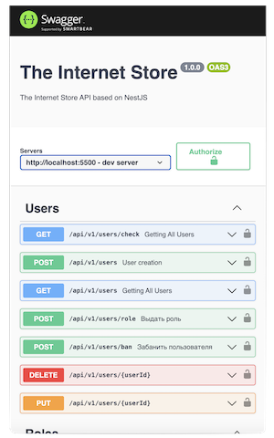

  <h1>Internet Store Full Stack Project</h1>

    
  
  <h2>Frontend JS TS App</h2>
  

    in progress...
     
     
    
  

  
     
  
  <h2>Android App</h2>
  

    
      
    
  

  
     
  
  <h2>IOS App</h2>
  

    
      
    
  

  
     
  
  <h2>Backend Nest.js App</h2>
  

    
    
     
     
    
  

  
     
  
  <h2>Backend Java Spring Boot App</h2>
  

    
    
     
     
    
  

