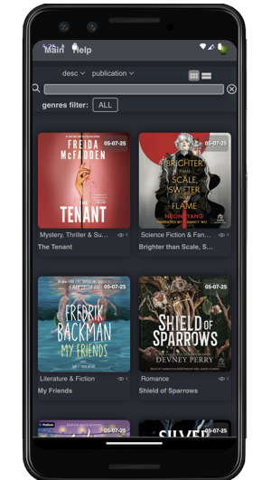
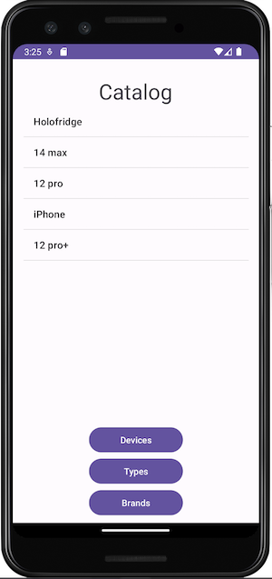
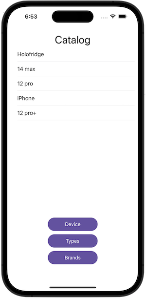

  <h1>Standard Internet Store</h1>
  
Full Stack Project

    
  
  <h2>Frontend App TS React Redux RTK query</h2>
  

    
     
     
    
  

  
  
     
  
  <h2>Backend Java App</h2>
  
STACK:

  Framework: Spring Boot, Hibernate 
  Auth: JsonWebToen, Spring Boot Security 
  RDBMS: PostgreSQL 
  Virtualisation: Docker 
  Documentation: Swagger 
  

    
    
     
     
    
  

  
     
  
  <h2>Backend Nest.js App</h2>
  

    
    
     
     
    
  

  
     
  
  <h2>Android Java App</h2>
  

    
      
    
  

  
     
  
  <h2>IOS Swift App</h2>
  

    
      
    
  

