

    <h1>Backend API: Java Spring Boot</h1>
    

        FRAMEWORK: Spring Boot, Hibernate
    

    

        RDBMS: Postgresql
    

    

        AUTH: Jsonwebtoken, Email login activation, spring-boot-security
    

    

        DOCUMENTATION: Swagger
    

    

        TEST: JUnit5, Mockito, MockMVC
    

    

        <h2>Model</h2>
        
    
 
    

        <h2>All endpoints</h2>
        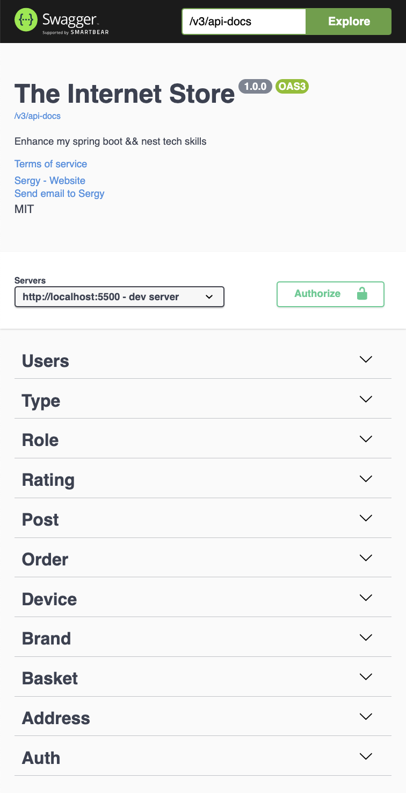
    

    

        <h2>User endpoint</h2>
        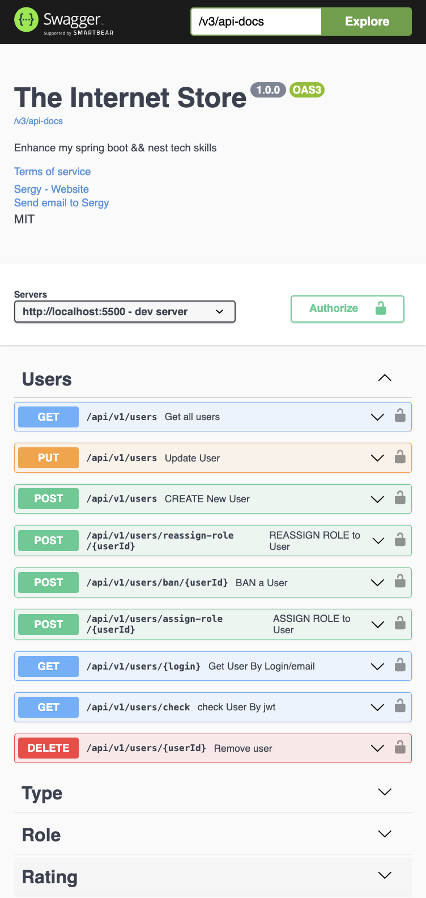
    

    

        <h2>Type endpoint</h2>
        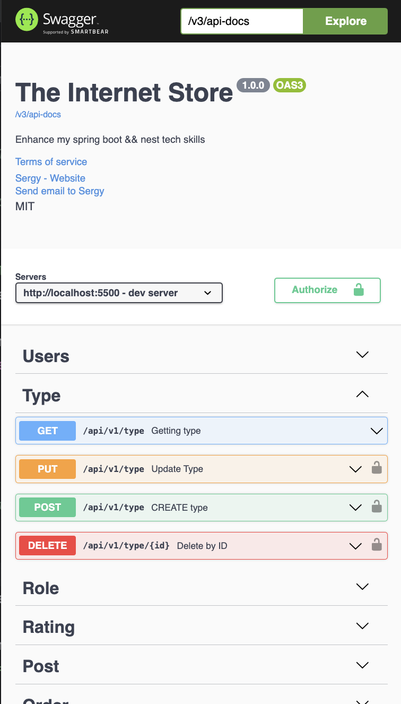
    

    

        <h2>Role endpoint</h2>
        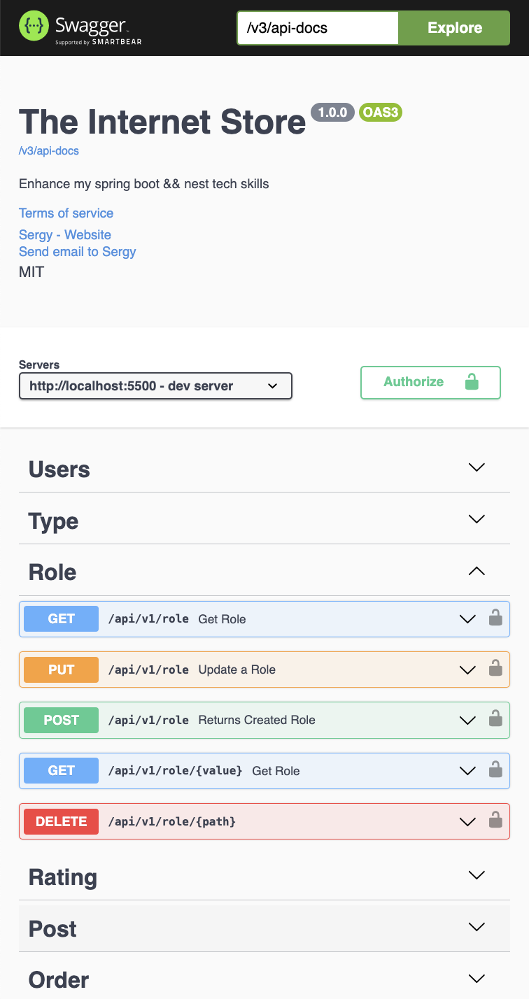
    

    

        <h2>Rating endpoint</h2>
        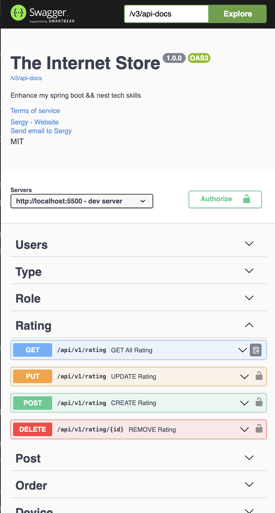
    

    

        <h2>Post endpoint</h2>
        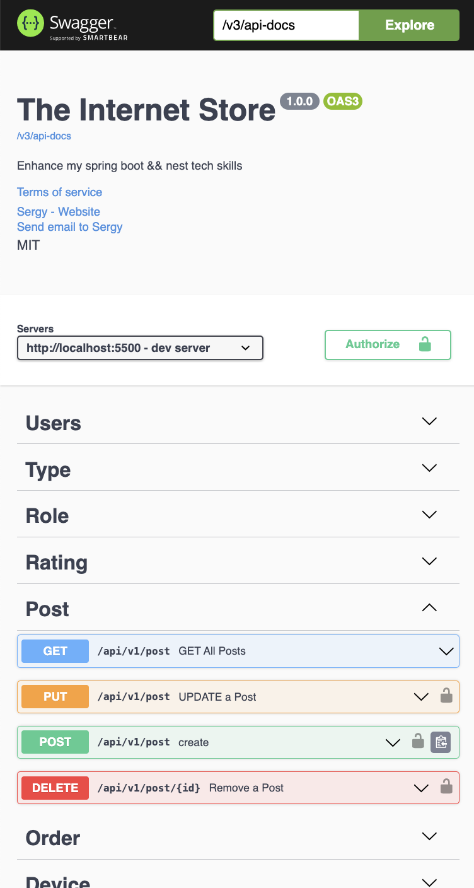
    

    

        <h2>Order endpoint</h2>
        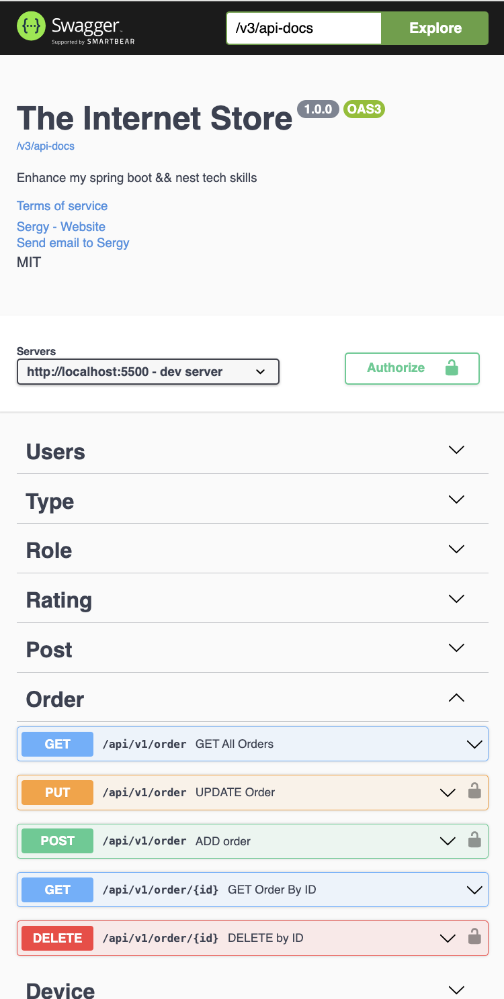
    

    

        <h2>Device endpoint</h2>
        
    

    

        <h2>Brand endpoint</h2>
        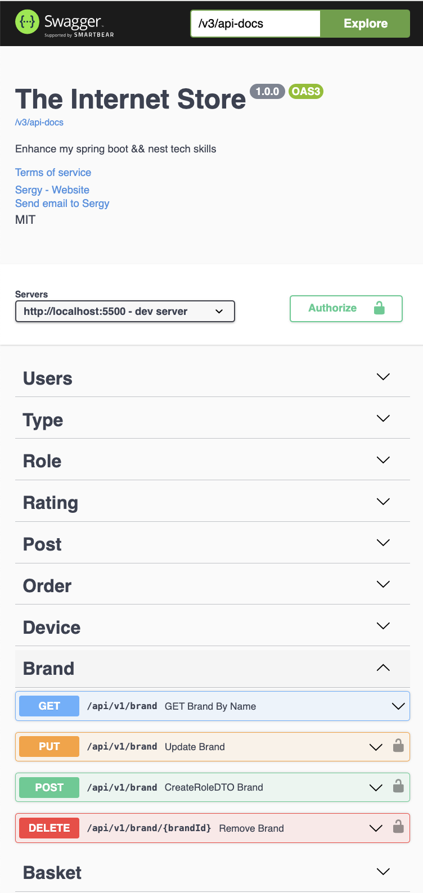
    

    

        <h2>Basket endpoint</h2>
        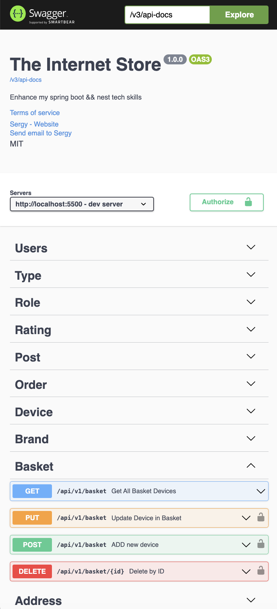
    

    

        <h2>Address endpoint</h2>
        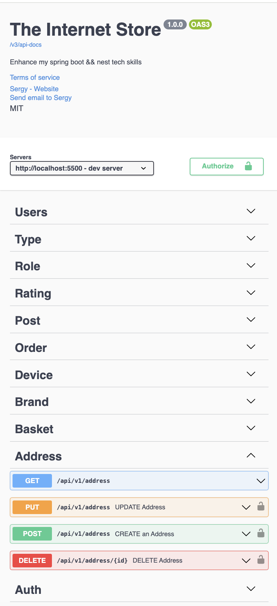
    

    

        <h2>Auth endpoint</h2>
        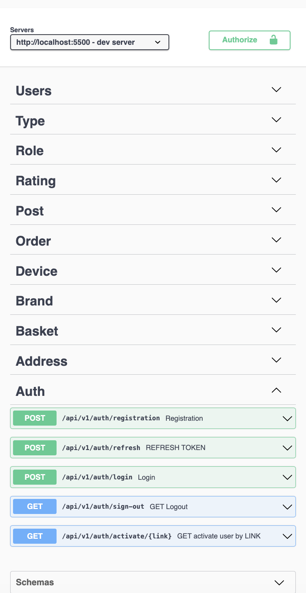
    

