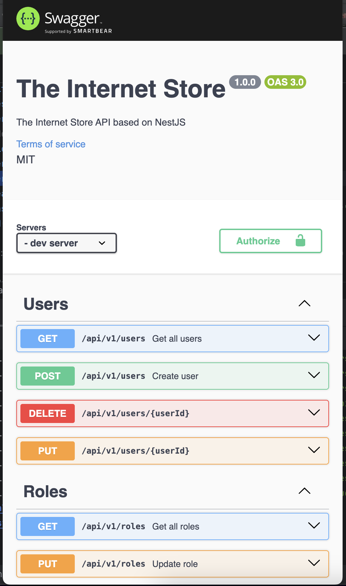

<h1 align="center">Nest Backend API</h1>
<h2 align="center">Documentation</h2>
<p align="center">
  
</p>

<br/>
<br/>

<details align="center">
<summary>Install and Use Here</summary>

## Installation

```bash
$ npm install
```

## Running the app

```bash
# development
$ npm run start

# watch mode
$ npm run start:dev

# production mode
$ npm run start:prod
```

## Test

```bash
# unit tests
$ npm run test

# e2e tests
$ npm run test:e2e

# test coverage
$ npm run test:cov
```

</details>